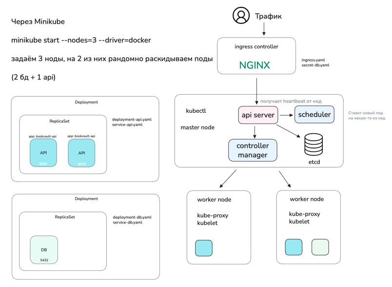

# bookvault-api

1. Установить на сервер k8s, minikube и Docker
- kubectl version
- docker version
- minikube version

2. Запустить 3 node через Minikube
- minikube start --nodes=3 --driver=docker

3. В GitHub Actions добавить

- SERVER_IP
- SSH_PRIVATE_KEY

